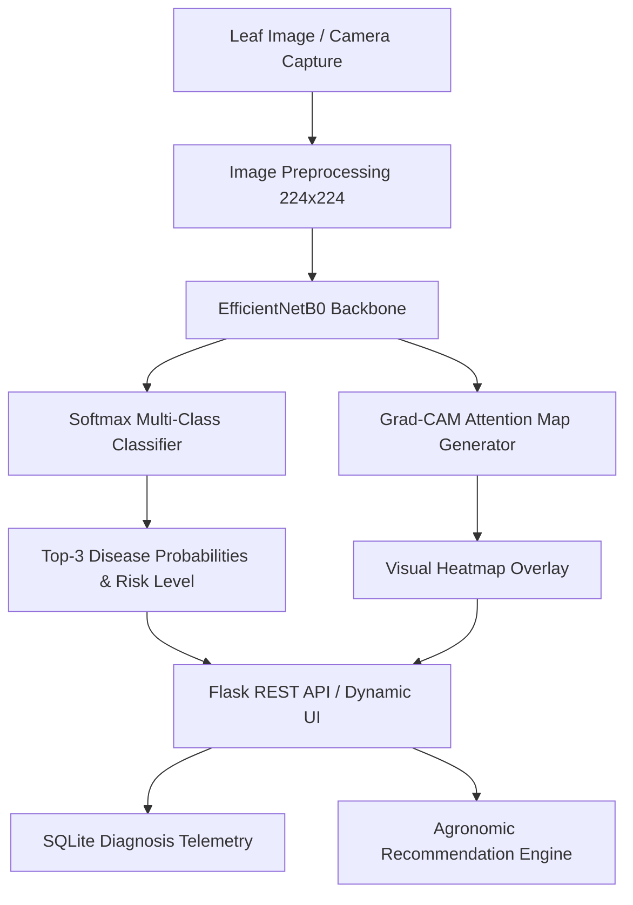

# SoyCare AI: Intelligent Soybean Leaf Pathology Diagnosis & Explainability

An end-to-end computer vision and agricultural decision-support web application for diagnosing foliar diseases in soybean (*Glycine max*). Built with **EfficientNetB0 Transfer Learning**, **Grad-CAM Visual Interpretability**, **Flask**, and **SQLite**.

---

## System Architecture



---

## Key Features

- **6-Class Pathological Classification:**
  - *Bacterial blight* (*Pseudomonas savastanoi pv. glycinea*)
  - *Downy mildew* (*Peronospora manshurica*)
  - *Frogeye leaf spot* (*Cercospora sojina*)
  - *Healthy foliage*
  - *Septoria brown spot* (*Septoria glycines*)
  - *Soybean rust* (*Phakopsora pachyrhizi*)
- **Grad-CAM Explainability (Class Activation Mapping):** Superimposes visual activation heatmaps onto raw leaf photographs, revealing the exact spatial lesions guiding the neural network's inference.
- **Dual Ingestion Channels:** Drag-and-drop file upload (JPG, PNG, WEBP) or real-time camera stream capture via WebRTC.
- **Agronomic Action Guidelines:** Actionable recommendations including immediate field scouting, targeted chemical/fungicide modes of action (FRAC groups), and crop rotation strategies.
- **Field Telemetry & History:** SQLite-backed audit log with real-time text search, risk filtering, pagination, and one-click CSV export.

---

## Current Model Experiment

The current development experiment uses real soybean leaf photos for three classes:
`Frogeye leaf spot`, `Healthy`, and `Soybean rust`.

The previous six-class benchmark was based on synthetic images and is not a
valid measure of real-world performance. Evaluation is generated from the
held-out real test split:

| Disease Class | Precision | Recall | F1-Score | Support |
| :--- | :---: | :---: | :---: | :---: |
| **Frogeye leaf spot** | 100.0% | 80.0% | 88.9% | 20 |
| **Healthy** | 100.0% | 85.0% | 91.9% | 20 |
| **Soybean rust** | 74.1% | 100.0% | 85.1% | 20 |
| **Overall Accuracy** | - | - | **88.3%** | **60** |

*Evaluation confusion matrix and metrics report are generated in `outputs/confusion_matrix.png` and `outputs/evaluation_report.json`.*
These results are an initial experiment on one Kaggle source and need external
validation before deployment.

---

## Directory Structure

```text
soyabean/
├── app.py                     # Flask web server & REST API endpoints
├── config.py                  # Centralized paths, thresholds, and logging configuration
├── requirements.txt           # Python dependencies
├── notebooks/
│   └── 01_model_training_and_evaluation.ipynb # End-to-end Jupyter training pipeline
├── src/
│   ├── __init__.py
│   ├── predict.py             # Inference pipeline with leaf validation & EXIF transpose
│   ├── gradcam.py             # Grad-CAM heatmap generation module
│   ├── export_tflite.py       # TFLite conversion & FP16/INT8 quantization
│   ├── train.py               # Two-stage EfficientNetB0 training script
│   └── evaluate.py            # Confusion matrix & benchmark evaluation
├── tests/                     # Automated Pytest unit & integration test suite
│   ├── conftest.py            # Test fixtures & test DB setup
│   ├── test_api.py            # Flask endpoint & SQLite tests
│   ├── test_predict.py        # ML inference & leaf validation tests
│   └── test_gradcam.py        # Heatmap overlay tests
├── Dockerfile                 # Multi-stage production container
├── docker-compose.yml         # Container orchestration configuration
├── knowledge_base/
│   └── disease_recommendations.json # Agronomic intervention profiles
├── outputs/                   # Generated evaluation plots and reports
│   ├── confusion_matrix.png
│   └── evaluation_report.json
├── static/
│   ├── css/style.css          # Design system & responsive layout
│   └── js/app.js              # Frontend controller & WebRTC camera logic
├── templates/
│   └── index.html             # Diagnostic dashboard web interface
├── data/
│   ├── raw/                   # Raw input datasets
│   ├── processed/             # Train, validation, test splits (224x224)
│   └── soycare.db             # Local SQLite scan history database
└── uploads/                   # Stored scan images and Grad-CAM overlays
```

---

## Quickstart Guide

### 1. Environment Setup
```bash
# Clone or navigate to the project directory
cd soyabean

# Activate virtual environment
source .venv/bin/activate

# Install dependencies
pip install -r requirements.txt
```

The project is tested with Python 3.13. If `.venv` does not exist, create it
with `/Library/Frameworks/Python.framework/Versions/3.13/bin/python3.13 -m venv .venv`.

For local development, enable debug explicitly only when needed:

```bash
export SOYCARE_DEBUG=true
export SOYCARE_SECRET_KEY="use-a-local-random-value"
```

The application refuses to generate diagnoses when the trained model is
missing. This is intentional: a demo or fallback prediction must never be
confused with an agricultural diagnosis.

### 2. Launch Application
```bash
python app.py
```
Open your browser at **`http://127.0.0.1:5000`**.

### 3. Automated Testing
Run the complete automated test suite with pytest:
```bash
pytest tests/ -v
```

### 4. Edge & Mobile Deployment (TFLite Export)
Convert trained Keras model into optimized `.tflite` binaries with FP16 or INT8 dynamic quantization:
```bash
python -m src.export_tflite --quantize float16
```

### 5. Docker Deployment
Launch with Docker and Docker Compose:
```bash
docker compose up --build
```

---

## Responsible Use & Field Disclaimer

SoyCare AI is a decision-support tool designed for agricultural education and preliminary scouting. Environmental variables, crop growth stages, and regional pathogen strains vary significantly. Always verify chemical and management decisions with a certified agricultural extension specialist.

---

**Author:** Aman Yadav  
**Project:** SoyCare AI Prototype
