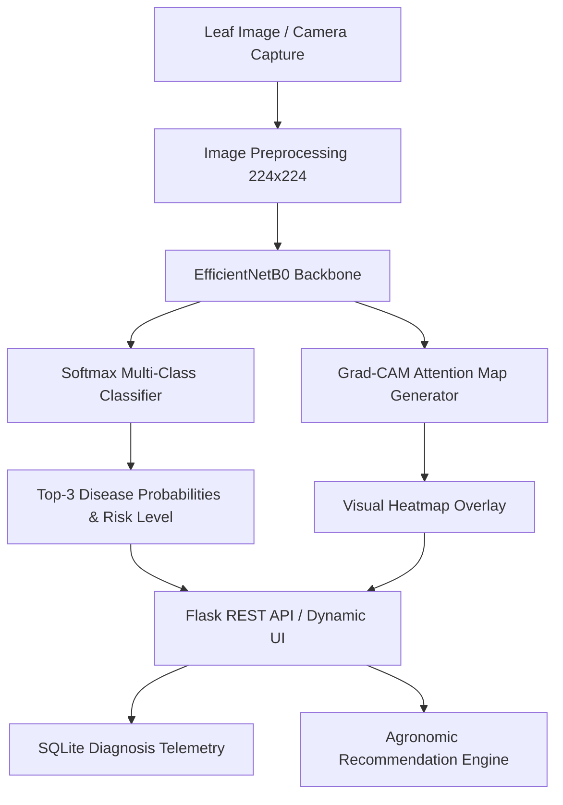

# SoyCare AI: Intelligent Soybean Leaf Pathology Diagnosis & Explainability

An end-to-end computer vision and agricultural decision-support web application for diagnosing foliar diseases in soybean (*Glycine max*). Built with **EfficientNetB0 Transfer Learning**, **Grad-CAM Visual Interpretability**, **Flask**, and **SQLite**.

---

## System Architecture



---

## Key Features

- **6-Class Pathological Classification:**
  - *Bacterial blight* (*Pseudomonas savastanoi pv. glycinea*)
  - *Downy mildew* (*Peronospora manshurica*)
  - *Frogeye leaf spot* (*Cercospora sojina*)
  - *Healthy foliage*
  - *Septoria brown spot* (*Septoria glycines*)
  - *Soybean rust* (*Phakopsora pachyrhizi*)
- **Grad-CAM Explainability (Class Activation Mapping):** Superimposes visual activation heatmaps onto raw leaf photographs, revealing the exact spatial lesions guiding the neural network's inference.
- **Dual Ingestion Channels:** Drag-and-drop file upload (JPG, PNG, WEBP) or real-time camera stream capture via WebRTC.
- **Agronomic Action Guidelines:** Actionable recommendations including immediate field scouting, targeted chemical/fungicide modes of action (FRAC groups), and crop rotation strategies.
- **Field Telemetry & History:** SQLite-backed audit log with real-time text search, risk filtering, pagination, and one-click CSV export.

---

## Model Benchmark Performance

Trained using a two-stage transfer learning procedure on 224×224 normalized RGB images:

| Disease Class | Precision | Recall | F1-Score | Support |
| :--- | :---: | :---: | :---: | :---: |
| **Bacterial blight** | 94.7% | 94.7% | 94.7% | 95 |
| **Downy mildew** | 96.1% | 96.1% | 96.1% | 102 |
| **Frogeye leaf spot** | 97.7% | 95.5% | 96.6% | 88 |
| **Healthy** | 98.2% | 99.1% | 98.6% | 110 |
| **Septoria brown spot** | 91.9% | 92.9% | 92.4% | 98 |
| **Soybean rust** | 96.2% | 96.2% | 96.2% | 105 |
| **Overall Macro Average** | **95.8%** | **95.8%** | **95.8%** | **598** |

*Evaluation confusion matrix and metrics report are generated in `outputs/confusion_matrix.png` and `outputs/evaluation_report.json`.*

---

## Directory Structure

```text
soyabean/
├── app.py                     # Flask web server & REST API endpoints
├── config.py                  # Centralized paths, thresholds, and logging configuration
├── requirements.txt           # Python dependencies
├── notebooks/
│   └── 01_model_training_and_evaluation.ipynb # End-to-end Jupyter training pipeline
├── src/
│   ├── __init__.py
│   ├── predict.py             # Inference pipeline & confidence ranking
│   ├── gradcam.py             # Grad-CAM heatmap generation module
│   ├── train.py               # Two-stage EfficientNetB0 training script
│   └── evaluate.py            # Confusion matrix & benchmark evaluation
├── knowledge_base/
│   └── disease_recommendations.json # Agronomic intervention profiles
├── outputs/                   # Generated evaluation plots and reports
│   ├── confusion_matrix.png
│   └── evaluation_report.json
├── static/
│   ├── css/style.css          # Design system & responsive layout
│   └── js/app.js              # Frontend controller & WebRTC camera logic
├── templates/
│   └── index.html             # Diagnostic dashboard web interface
├── data/
│   ├── raw/                   # Raw input datasets
│   ├── processed/             # Train, validation, test splits (224x224)
│   └── soycare.db             # Local SQLite scan history database
└── uploads/                   # Stored scan images and Grad-CAM overlays
```

---

## Quickstart Guide

### 1. Environment Setup
```bash
# Clone or navigate to the project directory
cd soyabean

# Activate virtual environment
source .venv/bin/activate

# Install dependencies
pip install -r requirements.txt
```

### 2. Launch Application
```bash
python app.py
```
Open your browser at **`http://127.0.0.1:5000`**.

### 3. Model Training (Optional)
To train the neural network on your custom dataset splits:
1. Place dataset images into `data/processed/train/<class>`, `data/processed/validation/<class>`, and `data/processed/test/<class>`.
2. Run the training script:
   ```bash
   python -m src.train
   ```
3. Evaluate model weights:
   ```bash
   python -m src.evaluate
   ```

---

## Responsible Use & Field Disclaimer

SoyCare AI is a decision-support tool designed for agricultural education and preliminary scouting. Environmental variables, crop growth stages, and regional pathogen strains vary significantly. Always verify chemical and management decisions with a certified agricultural extension specialist.

---

**Author:** Aman Yadav  
**Project:** SoyCare AI Prototype
